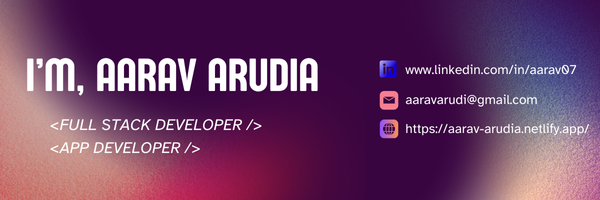

---

##  About Me
 From front-end pixels to back-end logic, and even some AI sparks in between  
 I’m a full stack developer , I build and engineer many cross-plarform mobile applications and web applications. I'm experienced with REACT, Next.js , Javascript ,React Native, Node.js , Mongo DB , etc.    

---

##  Tech Stack

### Languages  
              

### Frontend  
          

### Backend  
            

### Tools & Platforms  
                        

 

---

## GitHub Stats
  

---

##  Connect with Me

---
